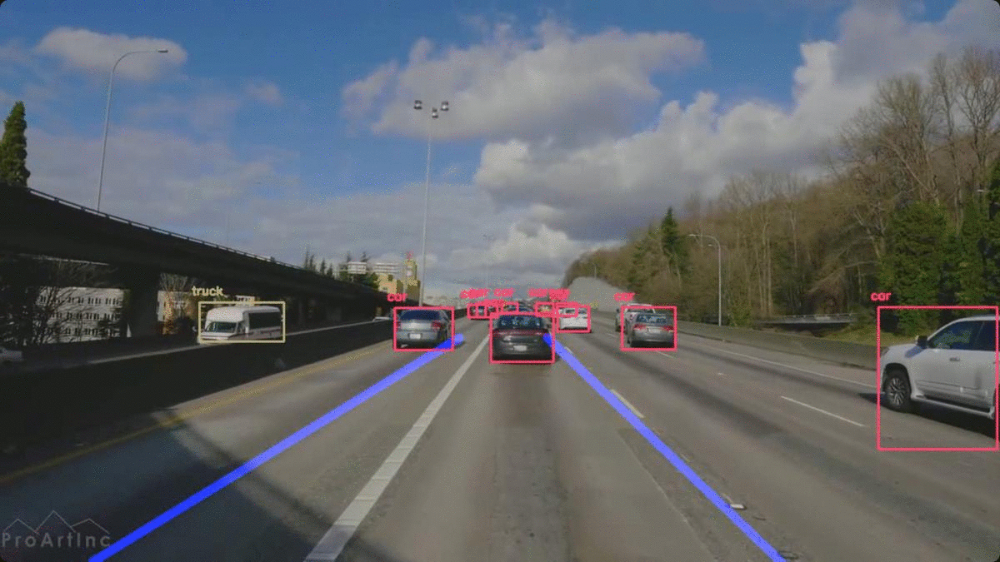

## Nathan Fernandes 
# Driver Guidance System - CS 677

This project implements:
## Object detection using deep learning with OpenCV and Lane Detection with Python
 
 ## Dependencies
  * opencv
  * numpy
  * yolov3.weights [file]
  * yolov3.txt [file]
  * yolov3.cfg [file]
 
You can download the pre-trained YOLO v3 weights file from this [link](https://pjreddie.com/media/files/yolov3.weights) and place it in the current directory or you can directly download to the current directory in terminal using
 
 `$ wget https://pjreddie.com/media/files/yolov3.weights`
 
 Provided all the files are in the current directory, the below command will apply object detection and lane detection on the input video
 
# Run Code

 `$ python lanes.py --video 1.mp4 --config yolov3.cfg --weights yolov3.weights --classes yolov3.txt`

* after --video, specify the video.mp4 name. **Imp:** Make sure that the video resolution is 720p for best results

* you can stop displaying the confidence on each object by removing ` +" "+str(round(confidence,2)) ` from line 37

* while the code is running, you can stop it and save the video to a folder called "test" by pressing the button `q` at anytime

* you can choose the number of frames per second in the output video by modifying line 205

## This is what the output will look like:

## View Presentation about this Project on:
https://www.youtube.com/watch?v=Ak420CoDJ9A&t=2s